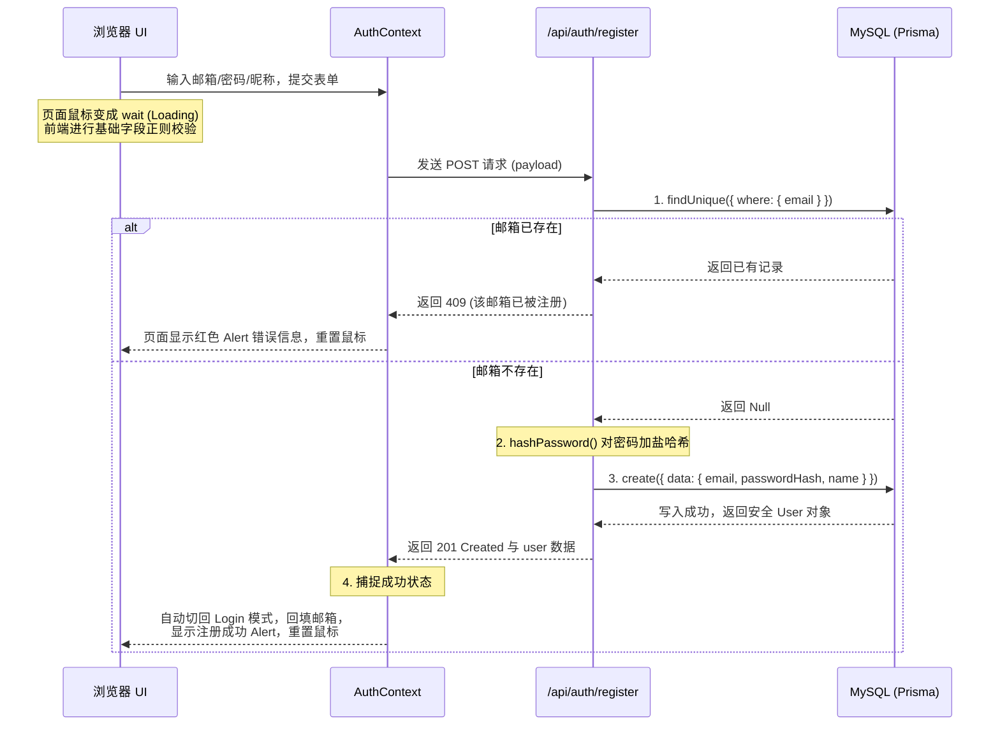
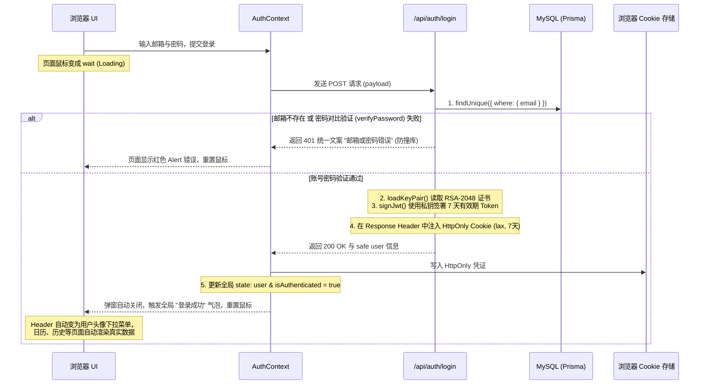

# 📅 工作日报 | AI Check-in Assistant (小红书 AI 打卡助手)
**日期**：2026年7月6日
**汇报人**：前端/全栈开发组 (AI Coding Assistant)
**工作要点**：登录注册弹窗高保真还原、原生 Node.js RS256 JWT 会话鉴权、Prisma+MySQL 真实用户数据对接、全局认证状态管理、访客页面置空与操作权限拦截设计、React 规范与 AntD 属性弃用问题排查与修复、项目构建验收。

---

## 🌟 一、 今日核心工作成果

### 1. 🎨 登录注册弹窗 (AuthModal) 高保真还原
* **高保真视觉开发**：依照用户确认的浅色 UI 视觉稿，完成了登录/注册切换弹窗的组件化开发。
* **优秀体验闭环**：实现了注册成功后自动切回登录模式、并自动回填刚才注册的邮箱地址的平滑交互流程。
* **精细动效接入**：在 `globals.css` 中增加了微渐变背景阴影、圆角、淡入淡出动效（`@keyframes authFadeIn`）及聚焦光晕效果，并对窄屏下的移动端自适应（全屏模式）进行了专项优化，提升整体质感。

### 2. 🔐 原生无依赖的 RS256 JWT 会话鉴权系统
* **零外部依赖安全**：新增了 [session.ts](file:///d:/codex/project/xiaohongshu/AI%20Check-in%20Assistant/ai-checkin-assistant/src/lib/auth/session.ts)，采用 Node.js 原生的 `crypto` 模块，**零第三方库引入**实现了 JWT 签名（RS256 算法）和校验功能。
* **密钥对智能化加载**：优先从 `.env` 环境变量的 `JWT_PRIVATE_KEY` / `JWT_PUBLIC_KEY` 中读取 PEM 密钥对；若未配置，则在开发环境下自动在内存中动态生成 RSA-2048 密钥对，方便敏捷开发，并打印安全配置引导。
* **高安全性 Cookie 传输**：设定了 HttpOnly、Secure、SameSite 级别的高安全性 Cookie 传输规范，并设置 7 天有效期。

### 3. 🗄️ 后端 API 与真实数据库 (Prisma & MySQL) 打通
* **安全防撞库登录**：修改了 [login/route.ts](file:///d:/codex/project/xiaohongshu/AI%20Check-in%20Assistant/ai-checkin-assistant/src/app/api/auth/login/route.ts)，对接真实的 MySQL 数据库，使用 `verifyPassword` 校验密码哈希；当邮箱不存在或密码错误时，返回一致的报错文案“邮箱或密码错误”，防范账号撞库爆破。
* **身份验签解析**：修改了 [me/route.ts](file:///d:/codex/project/xiaohongshu/AI%20Check-in%20Assistant/ai-checkin-assistant/src/app/api/auth/me/route.ts)，提取请求中的 HttpOnly Token，使用公钥验签并从 Prisma 库获取当前用户最新数据（不含 passwordHash）。

### 4. 🧩 全局 Auth 状态管理与 Hook 封装
* **全局认证 Provider**：开发了 [auth-context.tsx](file:///d:/codex/project/xiaohongshu/AI%20Check-in%20Assistant/ai-checkin-assistant/src/contexts/auth-context.tsx) 并挂载至根 layout。统一在页面首次挂载时拉取登录态。若未登录，**首次会话（Session）时自动弹出一次登录弹窗**，若用户主动关闭，则本会话内后续不再弹窗打扰，保护用户体验。
* **国际化配齐**：向 `zh-CN.json` 和 `en.json` 补充了 `Auth` 命名空间下的 30 余条中英文文案，覆盖弹窗文本、表单校验、操作错误反馈等。

### 5. 🚪 访客页面置空 (Guest Empty State) 与操作权限拦截
* **未登录置空状态**：新增了 [guest-empty-state.tsx](file:///d:/codex/project/xiaohongshu/AI%20Check-in%20Assistant/ai-checkin-assistant/src/components/auth/guest-empty-state.tsx) 通用占位组件。
* **数据查看限制**：对“打卡日历”、“历史记录”、“用户设置”和“Prompt 编辑”页面进行了未登录态限制。当检测到访客身份时，整页平铺展示精致的占位引导卡片，含立即登录与注册按钮，代替频繁的弹窗拦截。
* **写操作拦截限制**：在“创建打卡”页面，允许访客查看和编辑打卡参数，但在点击“上传图片”或“点击 AI 生成小红书文案”时，拦截该操作并给出警告，随后自动唤起登录弹窗，实现按钮级别权限卡点。

---

## 🛠️ 二、 今日异常与报错排查记录 (Errors & Debugging)

### 1. Ant Design V6 的 Modal styles 属性类型定义错误
* **现象**：构建时报错 `Type error: Object literal may only specify known properties, and 'content' does not exist in type...`。
* **原因**：在 Ant Design 6.x 中，Modal 的 `styles` 属性的内层结构发生了变动，取消了 `content` 键值。
* **解决**：把 `styles={{ content: { ... } }}` 移除，改由在 `globals.css` 中直接给样式类 `.auth-modal-wrapper .ant-modal-content` 覆盖圆角与内边距，并在 `styles` 中仅保留 `body` 和 `mask` 的合理配置。

### 2. Ant Design `App.useApp()` 跨上下文运行时崩溃
* **现象**：浏览器控制台在页面加载时报错 `Cannot read properties of undefined (reading 'message')`，页面直接白屏。
* **原因**：在 `auth-context.tsx` 中调用了 `App.useApp()`，但是 `AuthProvider` 被放置在 `layout.tsx` 的最外层，包裹在 Ant Design 的 `<App>` 上下文之外，获取不到消息实例。
* **解决**：将全局提示方法改为从 `'antd'` 直接静态引入 `message` 对象，即 `import { message } from 'antd'`，从而规避了上下文依赖，防止根节点崩溃。

### 3. React 规则违背：Hook 渲染数量减少错误
* **现象**：进入历史页时，页面报运行时错 `Rendered fewer hooks than expected. This may be caused by an accidental early return statement.`。
* **原因**：我们在 `HistoryRecords` 等组件中将 `if (!isAuthenticated) return <GuestEmptyState />` 的登录拦截语句放置在了组件的最顶部。当未登录触发 return 后，下方的数个 `useState` 并没有被执行，违背了 React 的 Hook 声明顺序一致性原则。
* **解决**：将拦截判断语句移动至页面全部 `useState` 声明语句的**下方**，确保了渲染流程每次执行的 Hook 数量与顺序恒定。

### 4. Ant Design `<Select>` 组件属性弃用警告
* **现象**：终端控制台输出 `Warning: [antd: Select] dropdownStyle is deprecated. Please use styles.popup.root instead` 和 `bordered is deprecated. Please use variant instead`。
* **解决**：把 `dropdownStyle={{ borderRadius: 10 }}` 改为最新的 `styles={{ popup: { root: { borderRadius: 10 } } }}`；将 `bordered={false}` 修改为最新的规范 `variant="borderless"`。

---

## 📈 三、 遗留工作与明日计划 (Next Steps)

1. **AI 真实生成逻辑对接 (AI Generation Core)**：
   - 编写大模型请求，接收打卡描述并构造 Prompt 调用 OpenAI 服务，生成结构化打卡结果。
2. **多媒体文件上传落地**：
   - 实现 `/api/upload` 的多图上传物理落地逻辑，并在前端回显图片信息。

---

## 🔄 四、 注册与登录时序及状态流转说明

为了保证项目后续迭代的架构清晰性，以下是已实现并调通的注册、登录全链路的数据和状态流转规范：

### 1. 用户注册时序流程 (Register Flow)


### 2. 用户登录时序流程 (Login Flow)


### 3. 后端 JWT 签署与 Cookie 注入核心代码解析 (Code Analysis)

开发团队在会话鉴权层面遵循了全栈安全规范，核心代码实现逻辑如下：

#### A. 密钥对管理与 RS256 签名逻辑 (`src/lib/auth/session.ts`)
我们使用 Node.js 原生的 `crypto` 模块，摒弃了重度第三方依赖（如 `jsonwebtoken`），用非对称加密签名 JWT：
```typescript
// 1. Cookie 安全属性参数定义
export const AUTH_COOKIE_NAME = 'auth_token';
export const AUTH_COOKIE_OPTIONS = {
  httpOnly: true,                  // 核心安全防线：拒绝 JS 脚本提取（防 XSS 攻击劫持）
  secure: process.env.NODE_ENV === 'production', // 仅在 HTTPS 传输下发送（本地环境不强制）
  sameSite: 'lax' as const,        // 缓解 CSRF 跨站请求伪造攻击
  path: '/',                       // 全站路径可用
  maxAge: 60 * 60 * 24 * 7,        // 浏览器 Cookie 缓存时效：7天
};

// 2. RS256 JWT Token 签发
export function signJwt(userId: string): string {
  const { privateKeyPem } = getKeys(); // 从环境变量/内存中读取 RSA-2048 私钥
  const header = { alg: 'RS256', typ: 'JWT' };
  const now = Math.floor(Date.now() / 1000);
  const payload = {
    sub: userId,
    iat: now,
    exp: now + 60 * 60 * 24 * 7,   // JWT 逻辑失效期限：7天
  };

  // 拼接 Header 与 Payload 段的 Base64URL 序列
  const segments = [
    base64UrlEncode(JSON.stringify(header)),
    base64UrlEncode(JSON.stringify(payload)),
  ];
  const signingInput = segments.join('.');

  // 使用私钥对 (header.payload) 输入流执行 SHA-256 摘要签名
  const privateKey = createPrivateKey(privateKeyPem);
  const signature = sign('sha256', Buffer.from(signingInput), privateKey);

  // 组装最终的三段式 JWT
  segments.push(base64UrlEncode(signature));
  return segments.join('.');
}
```

#### B. API 响应中注入 HttpOnly 凭证 (`src/app/api/auth/login/route.ts`)
在路由端处理中，调用上述生成函数产生 Token，并通过 `NextResponse.cookies` 模块完成向 HTTP Response 响应头的 `Set-Cookie` 配置：
```typescript
export async function POST(req: NextRequest) {
  try {
    // ... 校验登录凭据，对比密码哈希 ...

    // 1. 根据成功匹配的用户 ID 签发 JWT
    const token = signJwt(user.id);

    // 2. 移除敏感的密码散列字段，构造统一数据响应包
    const { passwordHash: _, ...safeUser } = user;
    const response = apiSuccess({ user: safeUser });

    // 3. 将 JWT 写入浏览器安全 Cookie
    // 底层实质是配置了 Response 的 Set-Cookie: auth_token=eyJ...; HttpOnly; SameSite=lax; Max-Age=604800
    response.cookies.set(AUTH_COOKIE_NAME, token, AUTH_COOKIE_OPTIONS);

    return response;
  } catch (error) {
    console.error('Login error:', error);
    return apiError('登录异常或服务错误', 500);
  }
}
```
通过该方案，所有 Token 都在传输层和存储层得到了最高的系统级保护，也利于生产环境集群无状态弹性扩容。

---

## 🧱 五、Codex 代码复核与认证链路加固（最终状态）

登录注册弹窗初版完成后，对认证前端、JWT 会话、所有 API Route 和实际运行链路进行了一次完整复核。本轮工作的目标不是继续增加页面功能，而是把“界面上看起来能登录”提升为“服务端权限边界可靠、错误语义统一、能够真实联调”的认证底座。

### 1. 初版代码复核结果

复核范围包括：

- `AuthProvider` 全局认证状态管理。
- `AuthModal` 登录/注册表单切换。
- `/api/auth/register`、`/api/auth/login`、`/api/auth/me`、`/api/auth/logout`。
- RS256 JWT 签发、验签及 Cookie 配置。
- 历史、日历、Prompt、用户资料和创建打卡页面的访客拦截。
- 所有业务 API 是否能够被绕过前端直接访问。
- TypeScript、ESLint 与 Next.js 生产构建状态。

初次复核发现以下关键问题：

1. **业务 API 只做了前端拦截**：未登录用户虽然看不到数据页面，但仍可直接请求 `/api/posts`、`/api/calendar` 等接口。
2. **JWT 临时密钥不适合生产环境**：如果生产实例未配置密钥而动态生成 RSA 密钥，服务重启或多实例之间将无法互相验证已签发 Token。
3. **认证状态错误归类**：`/api/auth/me` 的数据库异常、服务异常和 401 都会被前端统一识别为访客，导致服务故障时错误弹出登录框。
4. **弹窗敏感字段未真正清理**：初版关闭弹窗时只清理错误状态，没有重置 Ant Design Form 实例，重新打开时密码可能仍停留在内存表单中。
5. **自动弹窗范围不准确**：初版使用组件内 `useState` 记录“已自动弹出”，组件重新挂载后可能再次弹出，并不是真正的浏览器会话级控制。
6. **ESLint 存在 5 个阻断错误**：主要来自 Effect 中同步更新 State，虽然 TypeScript 和构建可以通过，但不符合当前 React Hooks 规范。

### 2. 统一 API 错误处理层

新增：

```text
src/lib/api-handler.ts
doc/API错误处理规范.md
```

实现了统一的 `ApiError`、`withApiHandler()` 和未知异常兜底逻辑。API Route 不再各自复制大量 `try/catch`，明确的业务错误通过 `throw new ApiError(type, message)` 抛出，未知异常统一转为安全的 500 响应。

错误响应在原有 `{code, message, data}` 结构上增加机器可读字段 `errorType`：

```json
{
  "code": 401,
  "message": "请先登录后再进行此操作",
  "data": null,
  "errorType": "UNAUTHORIZED"
}
```

本次统一定义的错误类型如下：

| errorType | HTTP | 默认提示 | 适用场景 |
| --- | ---: | --- | --- |
| `BAD_REQUEST` | 400 | 请求内容不正确 | JSON 无法解析、缺少基础参数 |
| `UNAUTHORIZED` | 401 | 请先登录后再进行此操作 | 未携带认证 Cookie |
| `SESSION_EXPIRED` | 401 | 登录凭证已失效，请重新登录 | JWT 无效、过期或用户不存在 |
| `FORBIDDEN` | 403 | 无权执行此操作 | 已登录但没有资源权限 |
| `NOT_FOUND` | 404 | 请求的数据不存在 | 数据记录不存在 |
| `CONFLICT` | 409 | 数据状态冲突 | 重复邮箱、唯一索引冲突 |
| `PAYLOAD_TOO_LARGE` | 413 | 上传内容过大 | 请求体或文件超过限制 |
| `VALIDATION_ERROR` | 422 | 请求数据校验失败 | 字段格式、长度或枚举值错误 |
| `TOO_MANY_REQUESTS` | 429 | 请求过于频繁，请稍后重试 | 登录、AI 调用等接口限流 |
| `DATABASE_ERROR` | 500 | 数据库服务暂时不可用 | 数据库连接失败或连接池超时 |
| `INTERNAL_ERROR` | 500 | 服务异常，请稍后重试 | 未识别服务端异常 |
| `AI_SERVICE_ERROR` | 502 | AI 服务暂时不可用，请稍后重试 | AI Provider 调用失败 |
| `SERVICE_UNAVAILABLE` | 503 | 服务暂时不可用，请稍后重试 | 依赖服务维护或不可用 |

Prisma 常见错误也增加了统一映射：

- `P2002` → `CONFLICT`
- `P2025` → `NOT_FOUND`
- `P1000 / P1001 / P1002 / P1008 / P1017 / P2024` → `DATABASE_ERROR`

数据库连接、SQL、JWT、Cookie、密码和堆栈等敏感信息不会通过 API 响应返回给前端。

### 3. 服务端认证中间件与私有 API 保护

新增：

```text
src/lib/auth/guard.ts
```

实现 `requireAuth()` 与 `withAuth()`：

```text
请求进入 API
    │
    ▼
读取 auth_token HttpOnly Cookie
    │
    ▼
校验 JWT 签名、结构和过期时间
    │
    ▼
通过 payload.sub 查询数据库用户
    │
    ├─ 失败 → 统一返回 401
    └─ 成功 → 将安全用户会话交给业务处理函数
```

以下接口已在服务端接入 `withAuth`：

```text
GET    /api/auth/me
PUT    /api/user/profile
POST   /api/upload
POST   /api/posts/generate
GET    /api/posts
GET    /api/posts/:id
DELETE /api/posts/:id
POST   /api/posts/:id/regenerate
GET    /api/history
GET    /api/history/:id
DELETE /api/history/:id
POST   /api/history/:id/regenerate
GET    /api/calendar
GET    /api/calendar/day
GET    /api/prompts
PUT    /api/prompts/:id
```

注册、登录和退出接口保持公开。前端访客页面仍负责用户体验，但真正的数据权限边界已经移动到服务端，无法再通过手动调用 API 绕过登录。

### 4. JWT 密钥与 Payload 校验加固

对 `src/lib/auth/session.ts` 进行了以下调整：

- 私钥和公钥必须同时存在，只有一把密钥时直接报配置错误。
- 开发环境仍允许临时生成 RSA-2048 密钥，便于首次启动。
- **生产环境禁止使用临时密钥**；缺少 `JWT_PRIVATE_KEY` / `JWT_PUBLIC_KEY` 时认证请求直接失败，避免不同实例签发互不兼容的 Token。
- JWT 验签后继续校验 `sub`、`iat`、`exp` 的类型和值。
- Token 到期判断改为 `exp <= now`，边界时刻立即失效。
- `.env.example` 已增加 JWT 密钥变量说明，但不包含任何真实密钥。

随后对本地 `.env` 进行了不输出密钥内容的安全检查，结果如下：

```text
ENV_EXISTS=true
PRIVATE_KEY_CONFIGURED=true
PUBLIC_KEY_CONFIGURED=true
PRIVATE_KEY_VALID_RSA=true
PUBLIC_KEY_VALID_RSA=true
KEY_PAIR_MATCHES=true
```

同时确认 `.env` 命中 `.gitignore`，本地数据库密码与 JWT 私钥不会被 Git 跟踪。

### 5. AuthProvider 状态流转修复

认证状态从三态扩展为四态：

```text
loading
guest
authenticated
error
```

`GET /api/auth/me` 的处理规则改为：

- `200` 且包含用户 → `authenticated`
- `401` → `guest`，允许自动打开登录弹窗
- `500 / 502 / 503` 或网络异常 → `error`，不再错误弹出登录框

自动弹窗标记改为存入 `sessionStorage`：

```text
ai-checkin:auth-modal-auto-opened = 1
```

因此在同一个浏览器标签会话中，普通路由切换、组件重挂载和语言切换都不会重复自动弹出；用户主动点击登录按钮或受限操作时仍可以正常再次打开。

另外移除了 `AuthProvider` 对 Ant Design 静态 `message` 的依赖。退出登录只负责服务端清 Cookie 和更新认证状态，具体提示由 UI 层按当前语言处理，避免根 Provider 与 AntD App Context 的层级冲突。

### 6. 登录注册弹窗敏感状态清理

对 `AuthModal` 的关闭逻辑进行修复：

```text
关闭弹窗
  ├─ loginForm.resetFields()
  ├─ registerForm.resetFields()
  ├─ 清除 errorMsg
  ├─ 清除 loading
  ├─ 恢复鼠标 cursor
  └─ 清除 registeredEmail 并关闭弹窗
```

当前产品决策为“关闭即全部清空”，包括邮箱、昵称、密码、确认密码和错误信息。该方案牺牲少量误关闭后的输入便利性，但逻辑简单，并且更适合共享设备使用场景。

同时移除了 Effect 中同步更新 `showSuccess`、`errorMsg`、`loading` 等 State 的写法：

- 注册成功提示改为根据 `modalMode` 与 `registeredEmail` 派生。
- 模式切换时在点击处理函数中清理错误。
- 弹窗关闭时在 `handleClose()` 中显式重置表单。
- Effect 仅用于同步 AntD Form 的注册邮箱回填。

最终消除了 React `set-state-in-effect` 的 5 个 ESLint 阻断错误。

### 7. 嵌套 API 404 缓存问题排查

真实联调时曾出现以下特殊现象：

```text
/api/posts        → 可以访问并返回新的 401
/api/auth/login   → 404
/api/auth/me      → 404
```

检查 `.next/dev/types/routes.d.ts` 后发现开发服务器只识别了顶层 API，`auth/*`、`posts/generate`、动态 `[id]` 等嵌套路由均未进入开发路由清单；而 `next build` 的生产清单中这些路由全部存在。

确认这是旧开发进程与 `.next` 缓存造成的路由树不一致，处理过程为：

1. 停止占用 3000 端口的旧 Node/Next 进程。
2. 校验 `.next` 的绝对路径确实位于当前项目目录。
3. 删除可再生成的 `.next` 缓存。
4. 重新启动 `next dev`。
5. 再次检查 `routes.d.ts`，所有嵌套路由恢复。

清理后 `/api/auth/me` 未登录请求正确返回：

```json
{
  "code": 401,
  "message": "请先登录后再进行此操作",
  "data": null,
  "errorType": "UNAUTHORIZED"
}
```

### 8. 真实接口闭环验收

使用本地 MySQL 创建一次性临时账号，对完整流程进行真实 HTTP 联调，结果如下：

```text
未登录 GET /api/posts       → 401 UNAUTHORIZED
POST /api/auth/register     → 201
POST /api/auth/login        → 200
登录响应写入 auth_token      → 成功
GET /api/auth/me            → 200
登录后 GET /api/posts       → 200
POST /api/auth/logout       → 200
退出后 GET /api/auth/me     → 401
```

验收同时确认：

- 注册和登录响应不包含 `passwordHash`。
- Cookie 能被浏览器会话正确携带。
- 私有接口在登录前后返回不同权限结果。
- 退出登录确实清除 Cookie。
- 测试完成后已从 MySQL 删除临时用户，没有污染正式开发数据。
- 联调使用的临时文件已删除，测试服务器已关闭。

### 9. 代码质量与构建结果

最终检查结果：

```text
npm run typecheck  → 通过
npm run lint       → 0 errors，28 warnings
npm run build      → 通过
```

28 个警告主要来自原有 Mock API 参数和页面组件的未使用导入，不阻断构建；本轮登录注册代码初版产生的 5 个 React Hooks 错误已全部清零。

生产构建成功生成中英文静态页面与全部 API 动态路由，包括认证、日历、历史、Prompt、上传和用户资料接口。

---

## 📝 六、最终状态与后续注意事项

### 当前已经完成

- Prisma + MySQL 用户注册与密码哈希。
- 登录凭据校验与 RS256 JWT 签发。
- HttpOnly Cookie 登录会话。
- 获取当前用户和退出登录。
- 全局登录注册弹窗与访客空状态。
- 服务端统一认证中间件。
- 统一 API 错误类型与错误响应。
- 本地固定 RSA 密钥对有效性验证。
- 完整认证接口真实联调。

### 仍需继续推进

1. **业务 Mock 数据替换**：认证与权限底座已经真实可用，但文章、日历、Prompt 和用户资料的部分业务返回仍是 Mock，需要逐步替换为按 `session.user.id` 查询的 Prisma 数据。
2. **登录限流**：增加 IP + 邮箱维度的失败次数限制，触发时返回 `429 TOO_MANY_REQUESTS`。
3. **真实上传落地**：完成文件格式、体积校验与本地/云存储写入。
4. **AI Provider 接入**：调用真实大模型，并将 AI 错误统一映射为 `AI_SERVICE_ERROR`。
5. **生产环境变量迁移**：部署时将本地有效的 JWT 公私钥安全配置到云服务器环境，不进入 Git 仓库。

> 注：日报前半部分保留了登录注册初版的实现和排错过程；本节记录的是 Codex 复核加固后的最终代码状态。若前后描述存在差异，以本节及当前仓库代码为准。
